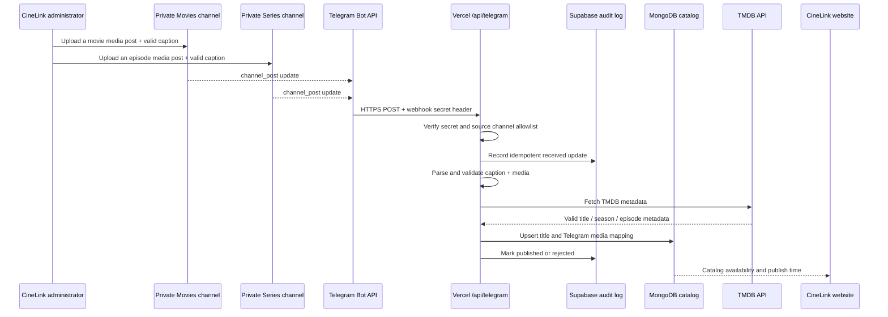

# CineLink Telegram Channel Auto-Publishing Flow

## Purpose

This flow turns a valid media post in one of CineLink's two private Telegram source channels into an available catalog entry on the website. It is intended only for content the operator is authorized to distribute.

Telegram supports HTTPS webhooks and provides `channel_post` updates for channel messages. A configured webhook secret is sent in the `X-Telegram-Bot-Api-Secret-Token` request header, which allows CineLink to reject unauthenticated requests.[1]

## Recommended Architecture

The following approach is event-driven: an administrator posts once, Telegram sends an update to the Vercel API route, and CineLink publishes the relevant catalog record without polling.



For a non-Next.js application, Vercel deploys functions defined under `/api`, so the initial webhook route can be a TypeScript file such as `api/telegram.ts`.[2]

## One-Time Setup Requirements

| Requirement | Movies channel | Series channel | Why it matters |
|---|---|---|---|
| Private source channel | Required | Required | Separates source media by content type. |
| CineLink bot added as channel administrator | Required | Required | Lets Telegram deliver channel updates to the bot and lets the bot operate in the channel. |
| Allowlisted numeric channel ID | Required | Required | Blocks a post from any unapproved chat from becoming catalog content. |
| Webhook update type | `channel_post`, optionally `edited_channel_post` | `channel_post`, optionally `edited_channel_post` | Reduces unexpected update handling. |
| Webhook secret token | Shared server secret | Shared server secret | The request header is validated before parsing. |
| Dedicated operator notification chat | Recommended | Recommended | Holds publication errors without cluttering source channels. |

The bot token, webhook secret, database credentials, and TMDB server key are server-side secrets. They must never use a `VITE_` prefix and must never be shipped to the browser.

## Caption Contract

The channel identity determines whether a post is a movie or a series. The caption provides the TMDB identity and, for a series, its episode identity. The parser should be deliberately strict; it must reject a caption it cannot understand rather than guess.

### Movies channel caption

```text
TMDB_ID: 27205
QUALITY: 1080p
LANGUAGE: Myanmar Sub
```

Only `TMDB_ID` is required for the first release. `QUALITY` and `LANGUAGE` are optional display metadata.

### Series channel caption

```text
TMDB_ID: 1399
SEASON: 1
EPISODE: 1
QUALITY: 1080p
LANGUAGE: Myanmar Sub
```

`TMDB_ID`, `SEASON`, and `EPISODE` are required. A series post that omits a season or episode is rejected. The production parser should also accept the previously discussed compact notation only if it is documented and tested, for example `TMDB:1399 S01E01`.

## Publishing Sequence

| Step | What the webhook does | Safe result |
|---|---|---|
| 1. Receive | Accept only `POST /api/telegram`. Read the raw Telegram update. | Non-POST requests receive `405`. |
| 2. Authenticate | Compare `X-Telegram-Bot-Api-Secret-Token` with `TELEGRAM_WEBHOOK_SECRET`. | A mismatch receives `401` and is not logged as content. |
| 3. Allowlist | Confirm that `channel_post.chat.id` equals the configured Movies or Series source channel ID. | Unknown channels receive `200` but are ignored and audited. |
| 4. Idempotency | Create or load an audit record keyed by `update_id`; use `channelId:messageId` as the media-mapping uniqueness key. | Duplicate delivery cannot publish a second title or episode. |
| 5. Validate | Require a supported media message, a caption, and the content-specific required fields. | Invalid posts become `rejected` with a readable reason. |
| 6. Enrich | Ask TMDB for the movie or series metadata and validate the type. For series, verify that the specified season and episode exist. | Wrong TMDB IDs or episode numbers do not become public catalog records. |
| 7. Persist | Upsert MongoDB title metadata and Telegram media source mapping in a transaction-like, idempotent order. | The canonical record is safe to retry. |
| 8. Publish | Set `publishedAt`, `status: published`, and `isAvailable: true`. | The website can display the entry and its NEW state. |
| 9. Audit | Store status, normalized caption fields, latency, and errors in Supabase. | Operators can diagnose failed posts and replay eligible events. |

The webhook must return quickly. A failure that prevents durable processing should leave the audit event in a retryable state; the code must reprocess that state safely when Telegram redelivers an update. Do not treat a duplicate `update_id` as automatically successful if the earlier attempt ended in `failed`.

## MongoDB Records

Use two logical collections to avoid losing episode-level mapping.

### `catalog_titles`

```ts
{
  _id: ObjectId,
  kind: "movie" | "series",
  tmdbId: number,
  title: string,
  posterPath: string | null,
  backdropPath: string | null,
  releaseDate: string | null,
  status: "published" | "unpublished",
  latestPublishedAt: Date,
  createdAt: Date,
  updatedAt: Date
}
```

Create a unique compound index on `{ kind: 1, tmdbId: 1 }`.

### `telegram_media`

```ts
{
  _id: ObjectId,
  kind: "movie" | "episode",
  tmdbId: number,
  seasonNumber: number | null,
  episodeNumber: number | null,
  channelId: string,
  messageId: number,
  fileId: string | null,
  fileUniqueId: string | null,
  quality: string | null,
  language: string | null,
  publishedAt: Date,
  status: "published" | "unpublished",
  sourceCaption: string,
  createdAt: Date,
  updatedAt: Date
}
```

Create a unique index on `{ channelId: 1, messageId: 1 }`. For a series, additionally index `{ tmdbId: 1, seasonNumber: 1, episodeNumber: 1, status: 1 }` to support deep-link lookup.

## Website and Deep-Link Behavior

The current frontend can continue browsing TMDB results. The new catalog API decides whether a particular title or episode is actually available through CineLink.

| Website action | Deep-link payload | Bot lookup |
|---|---|---|
| Movie Watch Here | `m_<tmdbId>` | Find published movie mapping by TMDB ID. |
| Episode Watch Here | `s_<tmdbId>_s<season>_e<episode>` | Find published episode mapping by TMDB ID, season, and episode. |

The bot validates the payload server-side, looks up the canonical record in MongoDB, and copies or sends the mapped media to the user. The channel identifier, message identifier, and raw file identifiers never need to be exposed to the browser. A user must initiate the bot through the Telegram deep link before the bot can respond in a private chat.

## Admin Outcome Model

Do not rely on a silent failure. Every channel post has one of the following states.

| Status | Meaning | Operator action |
|---|---|---|
| `published` | Caption, TMDB validation, and MongoDB mapping succeeded. | No action needed. |
| `duplicate` | The same Telegram post was received again. | No action needed. |
| `rejected` | Caption or media contract is invalid. | Correct the source post and publish a corrected post. |
| `failed_retryable` | A temporary TMDB, database, or network failure occurred. | Use a retry control after the service is back. |
| `unpublished` | An admin removed it from the website catalog. | Optionally retain source media in Telegram. |

For the first version, send error notices to a dedicated private admin chat or record them in a Supabase operations table. Avoid posting technical errors back to the Movies or Series source channels, which should remain clean media sources.

Edits and deletions should be a later, explicit policy. The safe first version is to process new `channel_post` messages only, permit metadata correction through an admin action, and implement unpublish separately. Do not assume deleting a channel message automatically removes the website catalog entry.

## Private Operational-Log Channel Notifications

Create a third private Telegram channel named, for example, `CineLink Logs`. It is not a content source channel and is not visible to users. The bot is an administrator in this channel with permission to post messages only. Its numeric ID is stored as `TELEGRAM_LOG_CHANNEL_ID` in server-side environment settings.

The source Movies and Series channel posts remain the source of truth. The log channel only reports the processed outcome, which gives the operator immediate visibility without exposing internal details on the public website.

| Trigger | Log-channel notification | Required fields |
|---|---|---|
| `published` | Success notice | Content type, TMDB ID, resolved title, movie or season/episode, source channel, source message ID, UTC publication time. |
| `rejected` | Validation warning | Content type, source channel/message ID, safe rejection reason, normalized fields if available, caption repair example. |
| `failed_retryable` | Operational error | Source channel/message ID, failure category, retry count, audit event ID, timestamp. Never include tokens, connection strings, or raw stack traces. |
| `duplicate` | No message by default | Record in Supabase only; optional summary messages can be enabled later. |

The selected default policy is to send only `published`, `rejected`, and `failed_retryable` notifications to the private operational-log channel. Duplicate updates are retained in Supabase audit records without a Telegram notification.

### Suggested Message Templates

```text
✅ Published
Type: Movie
Title: Inception
TMDB: 27205
Source: Movies channel · message 481
Published: 2026-08-15 12:30 UTC
```

```text
⚠️ Rejected channel post
Type: Series
Source: Series channel · message 922
Reason: EPISODE is required for a series post.
Expected: TMDB_ID: 1399 | SEASON: 1 | EPISODE: 1
```

```text
❌ Retry required
Source: Movies channel · message 482
Stage: MongoDB catalog write
Audit event: 6d7e...
Retry: 1 of 3
```

The webhook must persist the audit outcome before sending the log-channel message. A separate notification key, such as `auditEventId:status`, prevents Telegram retries from creating duplicate success or failure notices. If notification delivery fails after the catalog was successfully published, the catalog remains published; the audit event records `notificationStatus: failed` so a safe retry process can resend only the missing notification.

Never send bot tokens, webhook secrets, database connection strings, full request payloads, or unfiltered stack traces to the Telegram log channel. The notification sender must also avoid recursively processing its own messages by accepting channel-post updates only from the Movies and Series source-channel allowlist.

## Viable First-Release Choices

| Approach | Tradeoffs | Cost | Setup complexity |
|---|---|---|---|
| Strict caption + automatic publish | Immediate catalog availability; requires exact caption formatting and webhook security. | Uses the selected database and serverless plan. | Medium. |
| Strict caption + review queue | Operator approves parsed post before publication; safer for first production use but adds one click. | Similar infrastructure cost. | Medium-high. |
| Manual catalog entry after posting | Simplest operational control; no automatic channel-to-catalog sync. | Lowest initial cost. | Low. |

## Recommended First Decision

Choose whether valid captions should **publish immediately** or first enter a **review queue**. This choice determines the `status` transitions, admin notification behavior, and the first API endpoints to build.

## References

[1]: https://core.telegram.org/bots/api "Telegram Bot API"
[2]: https://vercel.com/docs/functions/functions-api-reference "Vercel Functions API Reference"
